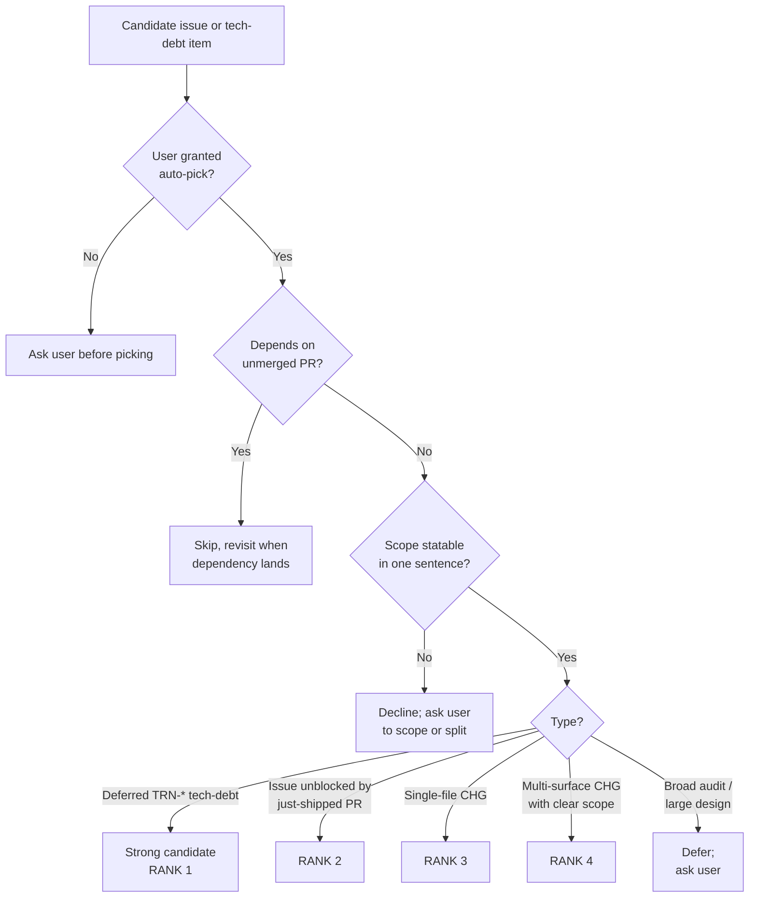
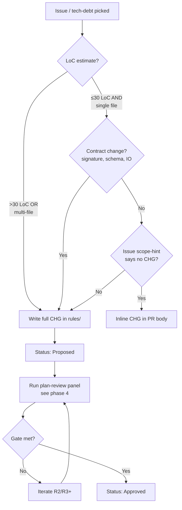
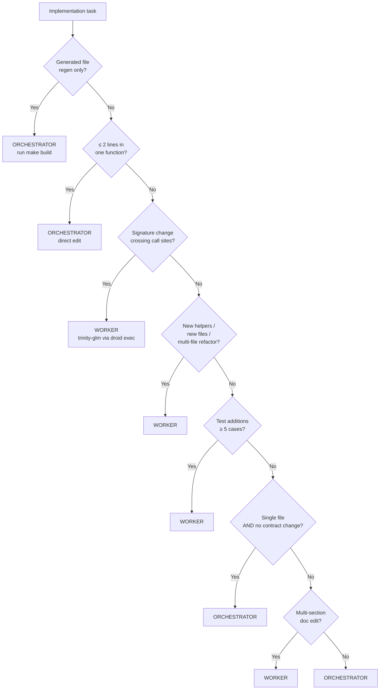
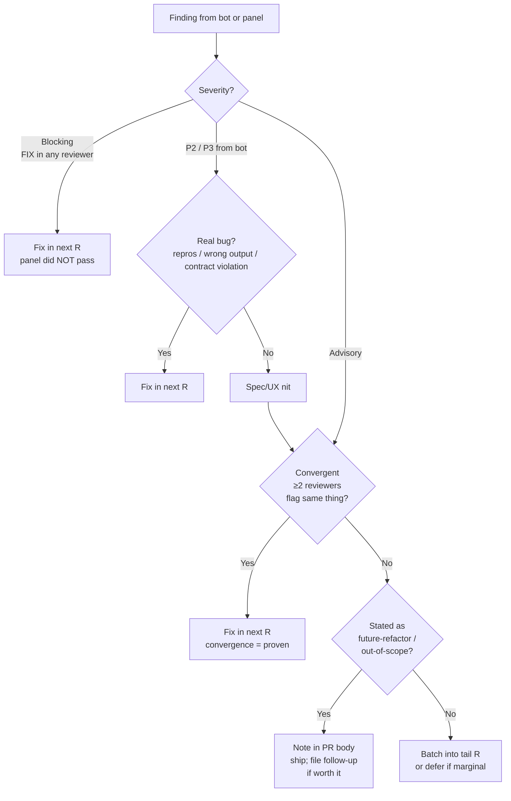

# SOP-1008: Multi-Agent Review Loop

**Applies to:** Trinity project (`frankyxhl/trinity`) — drafted for trinity scope; intended for promotion to PKG/COR-1200 once stable
**Last updated:** 2026-05-08
**Last reviewed:** 2026-05-08
**Status:** Active
**Related:** TRN-1007 (PR readiness gate), TRN-1800 (evolution philosophy / weights), CLD-1802 (atomicity surface definition), COR-1612 / COR-1614 / COR-1616 (PR-loop SOPs the panel inherits from)

---

## What Is It?

The end-to-end loop a Claude orchestrator runs to ship a PR through a 4-provider review panel: pick the next issue, plan, dispatch a worker, panel-review the plan, implement, panel-review the code, iterate on bot/CI findings, hand off to the user for merge, then auto-pick the next issue. It captures three independent levers (auto-pick, dispatch heuristic, panel-review gate) plus the surrounding loop hygiene (branch base, identity, bot triage) in one place.

This SOP exists because the loop was being re-derived ad-hoc each session. Without it, three failure modes recur:

1. **Stale-branch base** — branching off a local `main` that lags `origin/main`, producing phantom-reference bugs (PR #68 lesson).
2. **Wrong dispatch lane** — orchestrator hand-edits 200-line refactors that should go to a worker, or dispatches a 2-line typo fix that round-trips through `droid exec` for no reason.
3. **Wrong gate semantics** — accepting a 3-of-4 PASS panel as "good enough" instead of holding the all-individual-≥9.0 line, then later discovering the dissenter caught a real bug.

---

## Why

Multi-agent review (panel of 4 providers per major change) catches classes of bugs single-reviewer flows miss — convergence across heterogeneous models is high-signal. But running it cleanly takes discipline: parallel dispatch, correct weights, honest gate enforcement. The loop also has a worker layer (orchestrator delegates implementation to a coding worker via `droid exec`) and an auto-pick layer (orchestrator picks the next issue without user input). Each is a non-trivial decision; documented together they form a coherent operating model.

This SOP is also the foundation for cross-project reuse — when promoted to COR-1200, it becomes the default orchestration shape for any repo with a multi-provider review setup.

---

## When to Use

- Substantive PRs that touch behaviour, schemas, or public surfaces.
- Any PR where a single-reviewer judgment call could be wrong (architecture, contract changes, security-adjacent code).
- Cross-cutting refactors (multi-file rename, API rename, lifting an abstraction).
- New CHGs / SOPs / PRPs.
- The first PR of a session (also re-pins branch base + identity even if you skip the panel).

## When NOT to Use

- One-line bug fixes with an obvious cause (typo, missing import, wrong constant). Direct edit, single-reviewer or self-review, ship.
- Pure documentation changes that don't touch CHGs / SOPs (README polish, CHANGELOG re-flow). Self-review is fine.
- Generated-file regeneration (`make build`, `af index`). The generator is the reviewer.
- Reverts of an already-reviewed change (the original PR carried the panel; a clean revert inherits the gate).

---

## Steps

The loop has 10 phases:

```
1. Auto-pick      ← user's auto-pick policy
2. Branch hygiene ← pin origin/main, identity gate
3. Plan           ← draft CHG / spec
4. Plan-review    ← 4-provider panel, all-individual ≥9.0
5. Dispatch       ← worker heuristic (orchestrator vs trinity-glm)
6. Verify worker  ← read symbols, tests, lint, af-validate
7. PR open        ← push to fork, gh pr create
8. Iterate        ← CI poll, bot poll, code-review panel
9. Triage         ← real bug → fix; advisory → batch into R3+
10. Handoff       ← "mergeable" = orchestrator done; user merges
```

### 1. Auto-pick

When the user grants the auto-pick mandate ("once current PR is mergeable, pick next issue without asking"), rank candidates by this tree:



**Sample worked decision** (this session, post-#71-merge):

| Candidate | Rank | Why |
|-----------|------|-----|
| TRN-3027 (deferred from PR #66 review) | 1 | doc-only, single-file, scope statable: "amend TRN-1006 §A to point to registry.json" |
| TRN-3026 (env-var pins → registry) | 4 | medium, registry shape extension — clear but not smallest |
| TRN-3025 (gemini canonical) | — | deferred until quota; one-sentence scope still uncertain |
| #40 (audit codebase) | — | scope unbounded → ask user |
| #63 (TRN-3024 MCP bridge) | — | large design → ask user |

→ picked TRN-3027.

### 2. Branch hygiene (PR #68 lesson)

Before every R1 dispatch:

```bash
git fetch origin main
git status -uno              # confirm clean
git log origin/main --oneline -3   # verify expected merge state
git checkout main && git pull origin main && git checkout -b codex/<slug>
```

The `git fetch origin main` is non-negotiable. Branching off a local `main` that lags upstream produces phantom-reference bugs (where a panel reviewer references a file that's been moved/deleted on origin/main but still exists on the stale local).

Identity gate before any GitHub-visible write:

```bash
gh auth status               # must show: ryosaeba1985 active
```

If the wrong account is active, abort. Public artifacts authored by the wrong identity are a CLAUDE.md-level violation and require immediate close-and-replace.

### 3. Plan (draft CHG / spec)



**CHG skeleton** (sections shown as bold labels; in a real CHG these are `##` headings — see e.g. `rules/TRN-3022-CHG-*.md` for a worked instance):

- **Frontmatter**: `Applies to`, `Last updated`, `Last reviewed`, `Status: Proposed`, `Date`, `Requested by`, `Priority`, `Change Type`, `Targets`, `Closes #<issue>`, `Builds on <prior TRN>`.
- **What** — one paragraph: what changes.
- **Why** — one paragraph: why this matters; cite session evidence / failed CI / PR-review finding.
- **Out of Scope** — bullets; defer items to follow-up CHGs by name.
- **Surfaces** — table: # | Surface | Change. One row per file or symmetric class (per CLD-1802).
- **Acceptance Criteria** — bullets `A1: ...`, `A2: ...`. Each must be observable and testable.
- **Implementation Order** — numbered steps; final step is verify + CHANGELOG + commit.
- **Change History** — table: Date | Change | By.

**Heuristic:** when in doubt, write the CHG. Five minutes drafting is cheaper than a panel reviewing the wrong thing.

### 4. Plan-review (4-provider panel)

Dispatch all 4 in parallel via the `Agent` tool. **Parallelism is required** — running serially burns 5x the wall-clock and fragments the cache window.

```mermaid
flowchart LR
    A[CHG drafted<br/>Status: Proposed] --> B[Dispatch 4 in parallel]
    B --> G1[gemini]
    B --> G2[codex]
    B --> G3[glm]
    B --> G4[deepseek]
    G1 --> J[Collect 4 verdicts]
    G2 --> J
    G3 --> J
    G4 --> J
    J --> K{All 4 individual<br/>≥ 9.0 AND<br/>all blocking == []?}
    K -- Yes --> L[Status: Approved<br/>→ phase 5]
    K -- No --> M[Triage findings<br/>see phase 9]
    M --> N[Apply fixes to CHG]
    N --> A
```

**Sample plan-review prompt** (template — fill the `<...>` slots):

```
Provider: <gemini|codex|glm|deepseek> (PLAN REVIEWER role).
Project: /Users/frank/Projects/trinity.
Branch: <branch-name> (head <short-sha>, off origin/main <short-sha>).

INVOKE the <provider> CLI for the actual review.

TASK: Plan-review of <CHG-ID> at `rules/<CHG-file>.md`.
Score per **TRN-1800 weights** (rules/TRN-1800-REF-Evolution-Philosophy.md):

| Dimension | Weight |
|-----------|--------|
| Test coverage of changed surface | 30% |
| Cross-platform parity | 20% |
| Compression ratio | 20% (net-positive justified by new tests/SOP) |
| Scope restraint | 15% |
| Necessity | 15% |

USE TRN-1800, NOT CLD-1800 (the .claude repo philosophy doesn't apply here).

## What to scrutinize
<bulleted list of the 3-5 things you most want this reviewer to check —
e.g. "verdict precedence ordering", "stderr-sentinel boundary detection",
"backwards-compat invariant in the legacy path">

## Output schema (REQUIRED — emit at END)

After concise free-form review, emit EXACTLY ONE fenced JSON block:

```json
{
  "decision": "PASS" | "FIX",
  "weighted_score": <0.0-10.0>,
  "blocking": [{"title": "...", "evidence": "file:line", "fix": "..."}],
  "advisories": [{"title": "...", "evidence": "file:line", "fix": "..."}],
  "confidence": <0.0-1.0>
}
```

Rules: PASS only when blocking == [] AND weighted_score >= 9.0.
LAST fenced ```json block in your output.
```

**Common R1 universal blockers** (catalogue):
- Returncode precedence undefined (TRN-3022)
- I/O contract widening, e.g. write_synthesis return type (TRN-3022)
- Static-template constraints incompatible with runtime gating (TRN-3022)
- Stale-base reference / phantom file (TRN-3021 — fixed by phase-2 branch hygiene)
- Panel reviewing CLD-1800 weights instead of TRN-1800 (PR #69 R3 lesson)

**Gate enforcement**: all-individual ≥ 9.0 AND every reviewer's `blocking` empty. Mean is informational only.

| Panel result | Action |
|--------------|--------|
| 4 PASS, mean ≥ 9.0, all blocking empty | Status: Approved → phase 5 |
| 3 PASS + 1 FIX | NOT passed — fix dissenter's blockers, re-dispatch |
| 4 PASS but one reviewer at 8.95 | NOT passed — 8.95 ≠ "near-pass"; fix or justify |
| 4 PASS, blocking empty, advisories present | Passed — fix convergent advisories before code-review (phase 8) |

### 5. Dispatch — orchestrator vs worker



**Why the threshold matters**: every `droid exec` round-trip costs ~30-90s + the worker's own context window. For a typo fix that's a 95% loss; for a 200-line refactor that's a 95% gain (orchestrator context stays clean for plan-review prompts).

**Edge cases not in the tree:**

- **Symbol rename across N files** → worker (even if each per-file change is small).
- **Coordinated edit to one section + one test** → orchestrator (still single conceptual change).
- **5+ small fixes from a bot batch** → orchestrator, sequentially. Don't dispatch a worker for a list of grep-and-replaces.
- **Investigation that may or may not require code** → orchestrator first; promote to worker only if the diagnosis grows.

**Sample worker dispatch prompt** (sections shown as bold labels; in the actual `Agent` tool prompt these can be `##` headings — see PR #69 / #71 dispatch transcripts for worked instances):

- **Provider role line** — e.g. "Provider: glm (CODING WORKER role)".
- **Project + branch** — absolute project path; branch name + base SHA from `origin/main`.
- **Invoke directive** — e.g. "INVOKE `droid exec` for the actual edits".
- **Task** — point at the CHG path. Do NOT inline the full spec — the worker reads the file.
- **High-level summary** — one paragraph stating intent.
- **Implementation order** — numbered steps copied from CHG §Implementation Order.
- **Constraints (must-haves)** — bullets that capture panel-derived non-negotiables (e.g. "regex MUST use `(?ims)` — all 4 panel reviewers caught the missing `s` flag in v2"). These are the things the worker MUST NOT regress.
- **Verification** — fenced shell block listing exact commands: pytest, ruff check, ruff format --check, make verify-built (if providers/ changed), af validate.
- **Expected outputs** — test count, lint clean, format clean, af 0 issues.
- **Process constraints** — bullets:
  - Do NOT push or commit. Orchestrator handles git ops.
  - Do NOT update the CHG document — orchestrator adds the round history row.
  - Spec ambiguities → prefer the more conservative interpretation, flag in report.
- **Output** — request structured report: files modified, helpers added (file:line), modified signatures, test count + names, verification outputs, ambiguities resolved + how.

**Worker dispatch contract** (do not omit):
- Pass the CHG path; do not inline the spec.
- Specify implementation order.
- List exact verification commands.
- Constrain: do NOT push or commit.
- Ask for structured report.

### 6. Verify worker

Trust but verify. Worker output is a claim, not proof:

```bash
grep -n "<each-helper-name>" scripts/<file>.py    # symbols exist
.venv/bin/pytest tests/ -q | tail -5              # all green
.venv/bin/ruff check <changed-paths>
.venv/bin/ruff format --check <changed-paths>
make verify-built 2>&1 | tail -2                  # if providers/ changed
af validate --root /Users/frank/Projects/trinity | tail -2
```

If any check fails, fix locally before push (or re-dispatch worker for substantial gaps). Spot-check 1-2 key invariants from the CHG by reading code (e.g. regex flags, constants, error-handler exception lists).

### 7. PR open

```bash
git add <specific-paths>                 # never -A (sweeps untracked tmp/, drafts)
git commit -m "$(cat <<'EOF' ... EOF)"   # HEREDOC for formatting
git push fork <branch-name>              # fork remote, not origin
gh pr create --repo frankyxhl/trinity --base main --head ryosaeba1985:<branch> ...
```

PR body includes: Summary / Why / Surfaces / Test plan / Files / `Closes #<issue>`. Plan-review gate scores belong in the body when applicable.

### 8. Iterate (CI + bot + code-review panel)

```mermaid
flowchart TD
    A[R<n> pushed] --> B[ScheduleWakeup<br/>delay=270s]
    B --> C{CI green<br/>both runners?}
    C -- No --> D[Read failing log<br/>fix → push R<n+1>]
    D --> A
    C -- Yes --> E{Bot reviewed<br/>this commit?}
    E -- No --> F[Wait another 270s]
    F --> E
    E -- Yes --> G{Bot 👍<br/>no findings?}
    G -- No --> H[Triage bot finding<br/>see phase 9]
    H --> A
    G -- Yes --> I{Code-review<br/>panel run yet<br/>on this head?}
    I -- No --> J[Dispatch 4-provider<br/>panel parallel]
    J --> K{All 4 ≥ 9.0<br/>blocking == []?}
    K -- No --> L[Triage panel findings<br/>see phase 9]
    L --> A
    K -- Yes --> M[Mergeable<br/>→ phase 10]
    I -- Yes --> M
```

**Polling cadence rules** (from `ScheduleWakeup` doc):
- Default: 270s (stays inside 5-min cache window).
- Never < 60s (rate limits, no signal benefit).
- Never == 300s (cache-miss penalty without amortization).
- For long jobs (CI slow, panel slow): 1200-1800s.

### 9. Triage



**Worked example** (PR #69 R3 → R4 triage):

| Finding | Reviewer(s) | Severity | Decision |
|---------|-------------|----------|----------|
| `results.index(result)` fragile | codex + glm + deepseek | Convergent advisory | Fix R4 |
| Surface 3 doc gap (3 of 6 providers miss section) | codex + deepseek | Convergent advisory | Fix R4 |
| `_render_findings_for` duplicate logic | deepseek | Single advisory | Fix R4 (compression boost) |
| Multi-provider all-legacy snapshot test | deepseek | Single advisory | Fix R4 |
| `task_type` case normalization | deepseek | Single advisory | Fix R4 |
| Future write_synthesis refactor | deepseek | Future-refactor | Note in PR body, ship |

Re-dispatch the panel only when blockers (or convergent advisories) were addressed. Pure single-advisory polish doesn't need re-scoring — the prior gate stands.

### 10. Handoff

When PR is mergeable (CI green, bot 👍, panel gate met, no open blockers):

- The orchestrator's job is done.
- Frank merges manually as repo owner. `ryosaeba1985` cannot merge under branch protection.
- Do NOT spam `gh pr merge --auto` retries; the GraphQL endpoint will reject.
- Move to phase 1 (auto-pick next issue).

---

## Worker Dispatch Heuristic (detail)

The 2-line threshold matters because every `droid exec` round-trip costs ~30-90s of latency plus the worker's own context window. For a typo fix that's a 95% loss; for a 200-line refactor that's a 95% gain (orchestrator context stays clean for the panel-review prompts).

Edge cases:

- **Symbol rename across N files**: worker, even if each per-file change is small.
- **Coordinated edit to one section + one test**: orchestrator (still single conceptual change).
- **5+ small fixes from a bot batch**: orchestrator, sequentially. Don't dispatch a worker for a list of grep-and-replaces.
- **Investigation that may or may not require code**: orchestrator first; promote to worker only if the diagnosis grows.

---

## Panel-Review Gate (detail)

**Why TRN-1800, not CLD-1800** (PR #69 lesson):

- CLD-1800 is the `.claude` repo's evolution philosophy (config-pruning surface). Compression weight is calibrated for net-negative LoC.
- TRN-1800 is the trinity repo's philosophy. Compression weight explicitly accepts net-positive when "justified by new tests, new SOP".
- Always verify the prompt names the project's own weights table. A misweighted panel will FIX a feature-add for the wrong reason.

**Why all-individual, not mean ≥9.0**:

- Means hide dissent. PR #60's lesson: a 3-of-4 PASS with mean 9.0 shipped a real bug the dissenting reviewer flagged.
- The all-individual gate forces every dissent to be addressed (or explicitly justified as out-of-scope).
- A reviewer scoring 8.95 isn't a "near-pass" — it's a fail the orchestrator iterates on.

**Convergence signal**: when ≥2 reviewers flag the same finding, treat it as proven (fix). Single-reviewer findings get triaged but may be deferred. Track the convergence count in the synthesis Summary block (TRN-3028).

---

## Auto-Pick Policy (detail)

The user grants auto-pick by saying something like "once mergeable, pick the next issue without asking". Until that grant, every issue pick goes through the user.

When granted, scope-rank the queue:

1. **Deferred internal tech-debt** (e.g. TRN-3025/3026/3027/3030) — usually doc-only or single-file, well-scoped from prior PR review.
2. **Issues unblocked by the just-shipped PR** — natural continuity.
3. **Single-file CHGs in the open issue list** — TRN-2027-shaped work.
4. **Multi-surface CHGs with clear scope** — TRN-3022-shaped work.
5. **Broad audits / large designs** — defer; ask before starting.

Never pick something whose scope you can't state in one sentence.

---

## Guard Rails

- **Never panel-review without TRN-1800 weights** in the prompt. CLD-1800 is for the `.claude` repo only.
- **Never accept 3-of-4 PASS as gate-met**. The dissenter's blockers must be addressed.
- **Never push to `origin/main`**. Push to `fork` (the `ryosaeba1985` remote).
- **Never bypass the identity gate**. `gh auth status` shows `ryosaeba1985` before any GitHub-visible write.
- **Never trust worker reports without spot-checking**. The worker says "done"; you verify "done".
- **Never sleep > 270s when cache is warm and you're polling**. The 5-min prompt-cache TTL is a real cost.
- **Never amend a published commit**. Add a new commit. The CHG history table tracks iterations.
- **Never skip the CHG for substantive changes**. Plan-review can't run without something to review.

---

## Examples

This session — 2026-05-08:

| PR | Issue | Lane | Plan-review | Code-review | Iterations | Outcome |
|----|-------|------|-------------|-------------|------------|---------|
| #69 | #39 (TRN-3022) | Worker | 4-round (mean 9.255) | 4-round (mean 9.45) | R1-R10 | Merged after 10 R-iterations; 4 bot findings + 5 panel advisories addressed |
| #70 | #57 (TRN-2027) | Orchestrator-direct | Skipped (issue scope: 5 lines) | Skipped (single test fixture) | R1 only | Merged immediately; bot 👍 |
| #71 | #55 (TRN-3028) | Worker | Inline-CHG (small) | 4-round (mean 9.31) | R1-R3 | Merged after R3; all-PASS on R1 panel |
| #72 | TRN-3027 (deferred) | Orchestrator-direct | Inline-CHG (doc-only) | Bot only | R1-R2 | Bot caught real Section A inconsistency in R1 |

Common pattern: panel-review ROI scales with surface size. PR #70 shipped clean without panel because the issue itself scoped it as 5 lines. PR #69 ran 10 R-iterations because the schema was new and got 6 architectural blockers in R1.

---

## Change History

| Date | Change | By |
|------|--------|----|
| 2026-05-08 | Initial draft (TRN-1008): captures multi-agent review loop developed across PR #66 → #72; intended for promotion to COR-1200 once stable | Claude Opus 4.7 |
