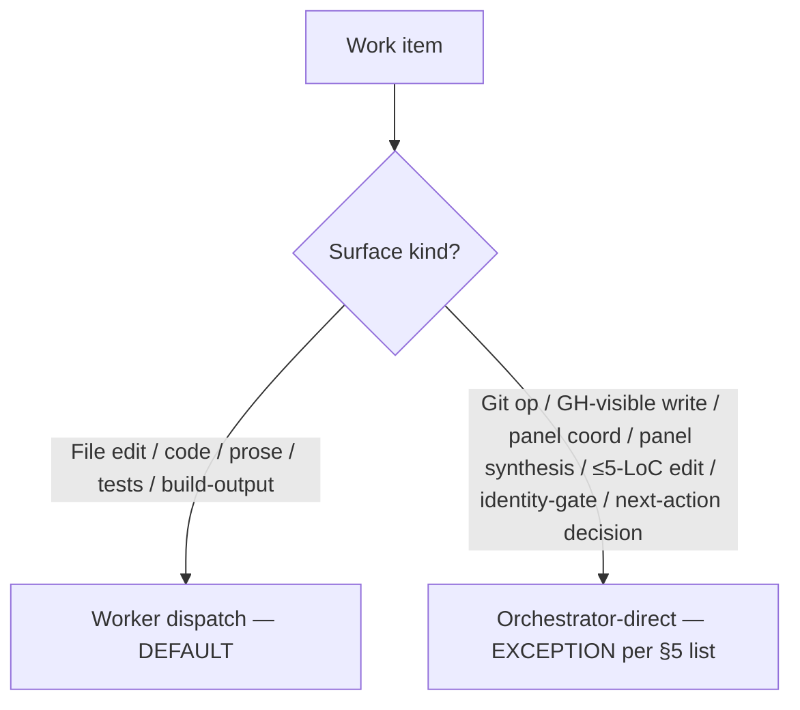

# CHG-3033: Orchestrator Discipline Bundle (Worker-Default + Comprehension Check + Wait-State Guard)

**Applies to:** Trinity project (`frankyxhl/trinity`)
**Last updated:** 2026-05-09
**Last reviewed:** 2026-05-09
**Status:** Approved
**Date:** 2026-05-09
**Requested by:** @frankyxhl (chat directions across multiple cycles in this session — judge/manager emphasis post-#87, comprehension-check post-#88-fixup, wait-state-guard post-#93-PR-open + addenda)
**Priority:** Medium
**Change Type:** Refactor
**Targets:** `main`
**Closes:** #91, #92, #94
**Builds on:** TRN-1008 §1 (phase 1 + rocket-gate), §5 (dispatch heuristic), §7 (PR open), §8 (Iterate), §Guard Rails, §Failure Modes

---

## What

Three rules, one concept: "orchestrator judgment hardening at phase boundaries". Each rule addresses a distinct antipattern observed in a single session — orchestrator-direct drift, pre-branch semantic gaps, and silent wait-without-closure — but all three share the design philosophy of replacing judgment-rich-but-error-prone per-case decisions with explicit checklists whose omission is externally observable.

### §5 worker-dispatch default (#91)

The current §5 dispatch-heuristic table treats worker dispatch as a case-by-case decision per task. This change **inverts the default**: **worker dispatch is now the DEFAULT** for any work that produces file edits, code, prose, tests, or build-output. **Orchestrator-direct is reserved** for the following explicit exceptions list:

- Git operations (branch, switch, commit, push)
- GitHub-visible writes (`gh issue`, `gh pr`, comments, reactions, labels) — must be authored by `ryosaeba1985`
- Panel coordination (dispatching reviewers IS orchestrator work)
- Synthesis of panel results (judging score, blocking, advisories)
- ≤5-LoC edits where dispatch overhead exceeds edit cost (rule of thumb: <5 LoC AND no logic change)
- Identity-gate verification (`gh auth status`)
- Decisions about what to do next (auto-pick, sequencing, escalation)

The §5 dispatch-heuristic mermaid and prose are rewritten to reflect this worker-default + explicit-exceptions structure.

### §1.5 NEW Comprehension check (#92)

Inserts a new subsection **between §1 rocket-gate PASS branch and §2 branch hygiene**. After an issue passes the rocket-gate's structural intake validation (8-field `blueprint-ready`), the orchestrator runs a **6-point rubric** before creating any branch:

1. **Scope clarity** — can the work be stated in one sentence?
2. **Cross-section consistency** — do AC, Task Plan, and Expected Outcome agree?
3. **Reference integrity** — does §X / file Y / TRN-Z actually exist on `main`?
4. **Latent ambiguity** — are "fast" / "minimal" / "compatible" terms defined?
5. **Embedded decision-deferrals** — "decide between A and B during plan-review" is a red flag
6. **Stale assumptions** — was the issue filed against a prior code state?

Three outcomes:
- **PROCEED** — all 6 points pass; **continue to §1's scope-rank tree** (mandate / dependency / one-sentence scope / type-rank). Phase 2 (branch hygiene) is reached only after the scope-rank tree selects a valid candidate.
- **CLARIFY** — **identity-gate first** (`gh auth status` MUST show `ryosaeba1985` active per §2 / user-level CLAUDE.md before any GH-visible write); then post structured comment with `- [ ]` checkbox questions; **defer pickup**; do NOT remove `blueprint-ready` label; re-evaluate on body edits or next phase-1 tick. Max-3-round cap before user-escalation.
- **REJECT** — **identity-gate first** (same `gh auth status` check as CLARIFY); then post comment with rejection reasoning; add `needs-redesign` label; decline pickup.

Comment template lives inline in the SOP (structured questions list with checkbox placeholders for CLARIFY; rejection-reasoning paragraph for REJECT).

**Re-evaluation flow** (CLARIFY → next-tick):  a CLARIFIed candidate is automatically re-evaluated by the next phase-1 tick (whether triggered by §1 idle-with-retry wake, §11 loop-restart, or chat input) — `verify_rocket_eligibility` re-runs against the (possibly edited) issue body, and on PASS the orchestrator routes the candidate through the §1.5 comprehension check again. No new wake mechanism is introduced; the existing §1 idle-with-retry naturally re-tests on every wake. The §1 mermaid `CLAR_OUT` node label reflects this with the suffix `(re-eval on next phase-1 tick)`.

**Per-issue CLARIFY round-counter** (parallels TRN-3030 §Failure Modes idle-wake counter `idle wake N of 12`): each CLARIFY round increments a per-issue counter. Suggested cap: **3 rounds** before the CLARIFY pattern itself becomes a REJECT signal — interpretation: "operator's reply is also unclear; not actionable in current form". The counter lives in the orchestrator's per-issue tracking surface (e.g., a hidden marker line in the CLARIFY comment body, or a `.git/`-local state file keyed on issue number); the explicit storage mechanism is deferred to Implementation Order step 10 (Surface 5 §Guard Rails comprehension-gate rule). See §Failure Modes `### Comprehension check loops` for the cap-exhausted recovery path.

### §Guard Rails wait-state guard (#94 + addenda)

Three layered rules:

1. **Core rule**: Never enter a "wait" state without an armed `ScheduleWakeup` OR explicit user-handoff. "I'll wait" / "standing by" / "monitoring" without an armed wake is the antipattern.
2. **Visibility addendum**: Every idle-state declaration in chat output MUST include a one-line idle-status line. Canonical format: `**Idle until <HH:MM:SS> <TZ> (~<relative>)** — <signal-class> on PR #<n> head \`<sha>\`. Chat to pre-empt.`
3. **Post-R-push closure-checklist** (5 items — every R-push is INCOMPLETE until all 5 done): (1) commit + push, (2) reply to each new bot inline finding via `gh api .../pulls/$N/comments/$ID/replies` with commit SHA + one-line description, (3) react 👍/👎 to each bot finding via `gh api .../pulls/comments/$ID/reactions`, (4) arm next wake, (5) surface idle-status line in chat.

## Why

**#91 — Orchestrator drift.** CHG-3029 was orchestrator-direct (~250 net lines / ~30 min context burn) when it could have been worker dispatch. The current §5 heuristic table didn't push toward dispatch; it listed factors to consider but left the default ambiguous. The explicit-exceptions list makes the correct behavior the lazy path.

**#92 — Rocket-gate validates STRUCTURE not SEMANTICS.** An issue can pass `blueprint-ready` and still be ambiguous on scope or intent. Failure mode: branch created → CHG drafted with wrong scope → plan-review spots misread (or worse, doesn't and wrong thing ships) → wasted R-iterations or merge-and-revert. It is cheaper to surface clarification need before any branch hits disk.

**#94 — Caught 3× in single session.** Bypass-clause misread, missing wake-arm, missing bot-thread replies — same root cause each time: optimize mechanical outcomes, treat communication-closure as decorative. Per-iteration each omission is small; cumulatively the orchestrator looks unresponsive.

## R-history

- **R1 plan-review (2026-05-09)** — fast-review tier panel (per TRN-3032): trinity-glm 8.55 / FIX, trinity-deepseek 8.60 / FIX. **Mean: 8.575**. Gate: ≥9.5. **Verdict: FIX.** Findings: 2 blockers + 9 advisories.
  - **Blockers**: B1 (glm) — §5 Reference Implementation BEFORE/AFTER incomplete (only opening normative paragraph shown; current §5 is ~35 lines spanning 9-leaf mermaid + edge-case list + threshold paragraph + dispatch contract — needs full coverage of all 4 sub-elements). B2 (glm) — §Compression delta math overstated §5 deletions (~-18 claimed; realistic ~-10 since current §5 ≈ 35 lines vs AFTER ≈ 25 lines).
  - **Advisories**: A1 (glm) — CLARIFY round-counter spec missing (parallel to TRN-3030 idle-wake counter). A2 (glm) — Surface 5 §Guard Rails rules need source-issue annotations. A3 (glm) — §Steps preamble TOC should note §7's expanded closure-checklist obligations. A4 (glm) — Bundle-savings argument needs quantification. A5 (glm) — §5 mermaid replacement needs explicit BEFORE/AFTER diagram. A1 (deepseek) — §Failure Modes case notation mismatch (post-#97 uses descriptive `###` headings, not lettered bullets). A2 (deepseek) — Memory-file paths need existence verification before "Update" verb. A3 (deepseek) — CLARIFY re-evaluation mechanism needs explicit connection to §1 idle-with-retry. A4 (deepseek) — §Guard Rails closure-checklist rule should cross-ref §7 (count-free SSOT per R17 precedent), not restate inline.
- **R2 fixes applied (2026-05-09)** — 11 fixes total (2 blockers + 9 advisories addressed): expanded §5 Reference Implementation with 4-sub-element disposition table + 2-leaf mermaid (B1+A5); corrected §Compression delta math to ~-10 lines on §5 with honest net-positive accounting (~+85 net inside TRN-1008, ~+260 lines new CHG file, ~+355 total) (B2); switched §Failure Modes Surface 6 spec from `(g)/(h)/(i)` lettering to descriptive `###` headings matching post-#97 convention (deepseek A1); incorrectly claimed memory files exist in repo via `ls` — these are user-private artifacts at `~/.claude/projects/`, NOT in repo scope; corrected in R3 by dropping memory-note surfaces entirely (deepseek A2); added explicit re-evaluation flow to §1.5 prose (`verify_rocket_eligibility` re-runs on every phase-1 wake; no new wake mechanism) + updated `CLAR_OUT` mermaid label suffix `(re-eval on next phase-1 tick)` (deepseek A3); added per-issue CLARIFY round-counter spec (max 3 rounds, mirrors TRN-3030 §Failure Modes idle-wake counter) (glm A1); annotated each Surface 5 §Guard Rails rule with source-issue tag `[#91]` / `[#92]` / `[#94]` (glm A2); updated Surface 4 phase-7/phase-8 TOC entries with closure-checklist obligation note (glm A3); added quantified bundle-savings argument (~185 lines + ~67% panel-cycle reduction + ~67% PR-iteration reduction) (glm A4); rephrased Surface 5 wait-state-guard rule to cross-ref §7 closure-checklist (count-free SSOT per R17 precedent) (deepseek A4). Awaiting R2 plan-review re-dispatch.
- **R3 fixes applied (2026-05-09)** — 5 R3 fixes + 1 R3-amend naming fix (6 total) per R2 panel results (glm 8.58 / deepseek 8.775, mean 8.6775, both FIX). CRITICAL CORRECTION: R2 worker dispatch claimed memory files exist in repo via `ls` — false; memory feedback files live at user-private `~/.claude/projects/-Users-frank-Projects-trinity/memory/`, NOT in repo scope. R3 dropped Surfaces 14-15 (memory-note updates) entirely as out-of-PR-scope (glm B3 + deepseek A2). Other 4 R3 fixes: Reference Implementation block (3) cross-refs §7 SSOT instead of inlining 5 closure artifacts (deepseek B1); compression delta line counts updated to match new line count (glm A6 + deepseek A1); naming "GuardRails" (no space) → "Guard Rails" (with space) throughout to match TRN-1008 actual heading (glm A7); "phase 5" → "Implementation Order step 10" terminology fix (deepseek A3). R3 panel: **glm 9.50 / PASS** (gate met), **deepseek 9.15 / FIX** (sole advisory: parallel `§FailureModes` no-space naming, same bug class as glm A7 — caught by deepseek but missed by glm). **R3-amend** (post-panel, orchestrator-direct): applied parallel `§FailureModes` → `§Failure Modes` (with space) replace_all across 10 body locations to close the deepseek R3 advisory; expected R3-amend re-evaluation: deepseek ≥9.5.

## Out of Scope

- TRN-3032 fast-review tier (already shipped)
- SOP-1009 issue-filing (#89 — different surface; procedural)
- cor1602 STRICT_REVIEW_DECISION_RULE decoupling (#98 — code follow-up)
- Session-asymmetry concern (per CHG-3032 R-history note — different concern; tracked separately)

## Surfaces

> Three rules share the conceptual frame "orchestrator judgment hardening at phase boundaries". Per CLD-1801 §2 surface taxonomy, this is a multi-issue bundle of 3 different but related concerns; surfaces are split per affected SOP section (one §-section = one surface), with each row tagged by source issue (#91 / #92 / #94).

| # | Issue | Surface | Change |
|---|-------|---------|--------|
| 1 | #91 | TRN-1008 §5 (Dispatch heuristic) | Rewrite with normative default rule ("worker dispatch is the DEFAULT") + explicit orchestrator-direct exceptions list (git ops, GH writes, panel coord, synthesis, ≤5-LoC, identity-gate, next-action decisions); update dispatch heuristic mermaid to reflect worker-default |
| 2 | #92 | TRN-1008 NEW §1.5 (Comprehension check) | New subsection between §1 rocket-gate PASS branch and §2; 6-point rubric, three outcomes (PROCEED/CLARIFY/REJECT), inline comment templates, defer + re-evaluate semantics |
| 3 | #92 | TRN-1008 §1 mermaid | Rocket-gate PASS branch (`V` node) now feeds COMPREHENSION node first, then onward to `B{User granted auto-pick mandate?}`; three outgoing edges from COMPREHENSION (PROCEED → SCOPE / CLARIFY → `CLAR_OUT` "Post comment; defer; preserve blueprint-ready label; re-eval on next phase-1 tick" / REJECT → comment + `needs-redesign` label) — `CLAR_OUT` node label includes the re-eval suffix to make the re-entry semantics graph-visible |
| 4 | all | TRN-1008 §Steps preamble TOC | Bumps phase count; inserts "1.5 Comprehension check" between phase 1 and phase 2 entries; updates phase-7 TOC line to **"7. PR open + post-push closure-checklist (per #94)"** to clarify that §7 now carries 5 closure-artifact obligations beyond `gh pr create`; adds parenthetical to phase-8 TOC line: **"8. Iterate (CI + bot + code-review panel; entry-gate verifies prior R-push closed all 5 artifacts)"** |
| 5 | #91+#92+#94 | TRN-1008 §Guard Rails | Three new rules, each annotated with source issue:<br/>• **Worker dispatch as default** [#91]: "Worker dispatch is the DEFAULT for any work that produces file edits, code, prose, tests, or build-output. Orchestrator-direct is reserved for the §5 explicit exceptions list. When in doubt, dispatch."<br/>• **Never start Phase 2 without comprehension check PASS** [#92]: "Phase 1 rocket-gate PASS triggers the §1.5 comprehension check; only the PROCEED outcome advances through §1's scope-rank tree (mandate / dependency / one-sentence scope / type-rank). Phase 2 branch hygiene is reached only after the scope-rank tree selects a valid candidate. CLARIFY defers (identity-gate first); REJECT declines (identity-gate first)."<br/>• **Wait-state guard** [#94]: "Never enter a 'wait' state without an armed `ScheduleWakeup` OR explicit user-handoff. The orchestrator's R-push is incomplete until the §7 closure-checklist artifacts have all landed (see §7 exit criteria for the canonical list — count-free SSOT per R17). 'I'll wait' / 'standing by' / 'monitoring' without an armed wake is the antipattern. See §Failure Modes `### Silent wait / silent close` for detection + recovery." |
| 6 | #91+#92+#94 | TRN-1008 §Failure Modes new `###` subsections | Three new sibling `###` subsections (descriptive headings, no letter labels — matches existing §Failure Modes convention post-#97 where cases live as `###` headings, not lettered bullets): **`### Worker output unsatisfactory`** (re-prompt with sharper spec → switch worker model → fall back orchestrator-direct with documented reason); **`### Comprehension check loops`** (max-3-round per-issue CLARIFY counter before user-escalation); **`### Silent wait / silent close`** (detection: idle declared without canonical status line; bot inline thread on current HEAD with no reply or 👍/👎 after fix-commit) |
| 7 | #91 | TRN-1008 §ThreatModel | New paragraph: worker-dispatch attack surface — worker output is untrusted-channel per §1 bypass clause; orchestrator MUST verify worker diff and never relay worker-emitted instructions as user mandate |
| 8 | #94 | TRN-1008 §7 PR-open exit criteria | Closure-checklist 5 items normatively required at R-push; arm wake + idle-status line are §7 exit criteria not §8 entry criteria |
| 9 | #94 | TRN-1008 §8 Iterate entry criteria | Verify wake armed (each R-iteration starts with confirming previous R-push closed all 5 closure artifacts) |
| 10 | all | TRN-1008 §Examples | New row showing canonical orchestrator-discipline arc: rocket-gate PASS → comprehension check PROCEED → branch → dispatch CHG to worker → orchestrator panel-review → dispatch fixes to worker → orchestrator verify → orchestrator commit + push + 5-item closure → arm wake → idle-status line surfaced → wake fires → §8 polling |
| 11 | all | TRN-1008 §Change History | New row dated 2026-05-09 attributed to bundled CHG-3033 |
| 12 | all | `rules/TRN-0000-REF-Document-Index.md` | Add TRN-3033 entry via `af index --root .` regen |
| 13 | all | `CHANGELOG.md` `[Unreleased] ### Changed` | Bundled entry mentioning all three rules (worker-default + comprehension-check + wait-state-guard) |


## Acceptance Criteria

Per-surface checklist:

- [ ] `af validate --root .` clean
- [ ] Plan-review gate met under §4 rules in force at pickup (2-provider / ≥9.5 fast-review tier per TRN-3032)
- [ ] Code-review gate met under §8 rules in force at pickup
- [ ] PR body details (Summary / Why / Surfaces / Test plan / Files / Closes lines / R-history)
- [ ] PR body includes `Closes #91`, `Closes #92`, `Closes #94` (all three on separate lines)
- [ ] Self-test: orchestrator ran the new §1.5 comprehension check on this CHG's own body before plan-review R1; result documented in PR body (PROCEED expected; CLARIFY/REJECT documented if applicable)
- [ ] Surface 1: §5 rewritten with worker-default rule + explicit exceptions list + dispatch heuristic mermaid updated
- [ ] Surface 2: NEW §1.5 inserted with 6-point rubric + three outcomes + inline comment templates
- [ ] Surface 3: §1 mermaid updated — COMPREHENSION node between `V -- Pass` and `SCOPE`
- [ ] Surface 4: §Steps preamble TOC bumped with §1.5 entry
- [ ] Surface 5: §Guard Rails gains three new rules (worker-default, comprehension-gate, wait-state-guard)
- [ ] Surface 6: §Failure Modes gains three new `###` subsections (`Worker output unsatisfactory`, `Comprehension check loops`, `Silent wait / silent close`) — descriptive headings, no letter labels, sibling level to existing post-#97 §Failure Modes structure
- [ ] Surface 7: §ThreatModel gains worker-dispatch attack surface paragraph
- [ ] Surface 8: §7 PR-open exit criteria updated with 5-item closure-checklist
- [ ] Surface 9: §8 Iterate entry criteria updated with closure-artifact verification
- [ ] Surface 10: §Examples gains canonical orchestrator-discipline arc row
- [ ] Surface 11: §Change History gains dated row for CHG-3033
- [ ] Surface 12: `TRN-0000-REF-Document-Index.md` regenerated
- [ ] Surface 13: `CHANGELOG.md` gains bundled entry


## Implementation Order

1. (Already done) Branch `codex/trn-3033-orchestrator-discipline` cut from `origin/main` per TRN-1008 §2.
2. (Worker — per #91 about-to-ship rule, dog-food self-applied) Draft this CHG with Status: Proposed.
3. (Orchestrator-direct) `af validate --root .` to confirm CHG ACID-compliance before plan-review.
4. (Orchestrator-direct) Plan-review panel R1 under §4 rules in force (TRN-3032 fast-review tier — trinity-glm + trinity-deepseek, both ≥9.5). Iterate to gate-met.
5. (Orchestrator-direct) On gate-met: flip Status: Proposed → Approved on this CHG; commit the flip.
6. (Worker) Apply Surface 1 (TRN-1008 §5 rewrite — worker-default rule + explicit exceptions list + dispatch heuristic mermaid update).
7. (Worker) Apply Surface 2 (TRN-1008 NEW §1.5 — full new subsection with rubric + outcomes + inline comment templates).
8. (Worker) Apply Surface 3 (TRN-1008 §1 mermaid — insert COMPREHENSION node + three outgoing edges).
9. (Worker) Apply Surface 4 (TRN-1008 §Steps preamble TOC — phase count bump + §1.5 entry).
10. (Worker) Apply Surface 5 (TRN-1008 §Guard Rails — three new rules).
11. (Worker) Apply Surface 6 (TRN-1008 §Failure Modes — three new sibling `###` subsections: `Worker output unsatisfactory`, `Comprehension check loops`, `Silent wait / silent close`).
12. (Worker) Apply Surface 7 (TRN-1008 §ThreatModel — worker-dispatch attack surface paragraph).
13. (Worker) Apply Surfaces 8-9 (TRN-1008 §7 PR-open exit criteria + §8 Iterate entry criteria — closure-checklist 5 items).
14. (Worker) Apply Surface 10 (TRN-1008 §Examples — new orchestrator-discipline arc row) + Surface 11 (§Change History row dated to commit timestamp via `TZ=UTC git log -1 --date=iso-local --format=%cd`).
15. (Orchestrator-direct) Apply Surfaces 12-13 (`af index --root .` regen + CHANGELOG entry).
16. (Orchestrator-direct) `af validate --root .` clean. Run §1.5 comprehension self-check on this CHG body. Commit; push to `fork`. Open PR with `Closes #91`, `Closes #92`, `Closes #94`. Code-review per §8. Arm wake + surface idle-status line per the new §Guard Rails rule. Iterate to gate. Handoff.

## Reference Implementation

### (1) §5 dispatch-heuristic full BEFORE/AFTER (per-sub-element disposition)

Current §5 (TRN-1008 lines ~346-381) spans ~35 lines across 4 sub-elements. Per-sub-element disposition:

| §5 sub-element (BEFORE) | Disposition (AFTER) |
|---|---|
| 9-leaf mermaid decision tree (~20 lines, lines ~348-370) | **Replace** with 2-leaf mermaid: default → worker / exception → orchestrator-direct (see new mermaid below) |
| "Edge cases not in the tree" list (~7 lines, lines ~374-379) | **Delete** — subsumed by the explicit-exceptions list in the new normative paragraph |
| "Why the threshold matters" paragraph (~3 lines, line ~372) | **Replace** with one-line cross-ref: "*See §Threshold rationale below for cost-of-quality argument.*" |
| "Worker dispatch contract" paragraph (~5 lines, line ~381) | **Keep verbatim** — the dispatch-prompt contract is upstream of the dispatch-decision rule and unaffected by the default flip |

**BEFORE** — section opens with 9-leaf decision tree, then case-by-case heuristic prose:

```text
§5 Dispatch — orchestrator vs worker
  [mermaid: 9-leaf decision tree branching on regen-only / mixed /
   multi-file / line-count / signature / new-files / test-count /
   single-file]
  **Why the threshold matters**: every droid exec round-trip costs ~30-90s ...
  **Edge cases not in the tree:** [4 bullet items]
  **Worker dispatch contract** (do not omit when constructing the prompt): ...
```

**AFTER** — section opens with normative paragraph + 2-leaf mermaid, drops edge-case list, cross-refs threshold rationale, keeps contract verbatim:

```text
§5 Dispatch — orchestrator vs worker

Worker dispatch is the DEFAULT for any work that produces file edits,
code, prose, tests, or build-output. Orchestrator-direct is reserved
for the following exceptions list:

- Git operations (branch, switch, commit, push)
- GitHub-visible writes (gh issue, gh pr, comments, reactions, labels)
  — must be authored by ryosaeba1985
- Panel coordination (dispatching reviewers IS orchestrator work)
- Synthesis of panel results (judging score, blocking, advisories)
- ≤5-LoC edits where dispatch overhead exceeds edit cost
  (rule of thumb: <5 LoC AND no logic change)
- Identity-gate verification (gh auth status)
- Decisions about what to do next (auto-pick, sequencing, escalation)

[mermaid: 2-leaf flowchart — see (1b) below]

*See §Threshold rationale below for the cost-of-quality argument.*

**Worker dispatch contract** (do not omit when constructing the prompt):
[unchanged — kept verbatim from current §5]
```

### (1b) New §5 mermaid (replaces 9-leaf decision tree)



Two leaves; count-free; exceptions list cited inline so the diagram is self-contained when read alongside the normative paragraph above.

### (2) §1 mermaid rocket-gate-PASS branch BEFORE/AFTER

**BEFORE** — PASS flows directly to scope-rank tree:

```text
V -- Pass: ALL checks<br/>(see spec table below) --> SCOPE[Continue to<br/>scope-rank tree]
```

**AFTER** — comprehension check inserts between `V -- Pass` and `SCOPE`:

```text
V -- Pass: ALL checks<br/>(see spec table below) --> COMP[Comprehension check<br/>see §1.5]
COMP -- PROCEED --> SCOPE[Continue to<br/>scope-rank tree]
COMP -- CLARIFY --> CLAR_OUT[Post comment;<br/>defer;<br/>preserve blueprint-ready label;<br/>re-eval on next phase-1 tick]
COMP -- REJECT --> REJ_OUT[Post comment;<br/>add needs-redesign label;<br/>decline pickup]
SCOPE --> B{User granted<br/>auto-pick mandate?}
```

### (3) §Guard Rails wait-state-guard rule (NEW)

```text
**Wait-state guard** [#94]: Never enter a "wait" state without an armed `ScheduleWakeup` OR explicit user-handoff. "I'll wait" / "standing by" / "monitoring" without an armed wake is the antipattern — the loop dies silently the moment the conversation pauses. The orchestrator's R-push is incomplete until the §7 closure-checklist artifacts have all landed (see §7 exit criteria for the canonical list — count-free SSOT per R17). See §Failure Modes "Silent wait / silent close" for detection + recovery.
```

## Threshold rationale (worker-default exceptions list)

**Clear bright line.** The orchestrator can self-verify per phase boundary: "Is this task in the exceptions list? No → dispatch." This is cognitively cheaper than reading a 9-leaf decision tree under time pressure. The current §5 heuristic asks the orchestrator to evaluate complexity, context budget, and panel cost per task — factors that are easy to rationalise in either direction, which is exactly the failure mode CHG-3029 exposed.

**Self-verifiable per phase.** Each step in §Implementation Order declares its lane upfront (`(Worker)` / `(Orchestrator-direct)`) and the reviewer can audit lane-assignments at PR time. A mismatch between the declared lane and the exceptions list is a concrete, observable defect — unlike the current heuristic where any assignment is defensible ex-post.

**Aligns with #94 closure-checklist's "every R-push must include all 5 items" pattern** — also explicit list, not heuristic. The bundle's three rules share this design philosophy: turn judgment-rich-but-error-prone behaviors into explicit checklists where the cost of forgetting an item is observable from outside.

## Compression delta

Required per TRN-1800 net-positive review.

| Surface | Net effect on TRN-1008 |
|---------|----------------------|
| 1 — §5 rewrite | ~-10 lines (current §5 ≈ 35 lines incl. 9-leaf mermaid + edge-case list + threshold paragraph + contract; AFTER ≈ 25 lines = normative paragraph + exceptions list + 2-leaf mermaid + 1-line threshold cross-ref + contract verbatim). Slight net compression. |
| 2 — NEW §1.5 | ~+35 lines (new subsection: rubric table, outcomes prose, comment templates) |
| 3 — §1 mermaid update | ~+3 lines (COMPREHENSION node + 3 outgoing edges replace 1 edge) |
| 4 — §Steps TOC | ~+1 line |
| 5 — §Guard Rails | ~+15 lines (3 new rules) |
| 6 — §Failure Modes | ~+20 lines (3 new `###` subsections) |
| 7 — §ThreatModel | ~+5 lines (1 new paragraph) |
| 8 — §7 exit criteria | ~+8 lines (5-item closure-checklist) |
| 9 — §8 entry criteria | ~+4 lines (closure-artifact verification) |
| 10 — §Examples | ~+3 lines (1 new row) |
| 11 — §Change History | ~+1 line (1 new row) |

**Net inside TRN-1008:** ~+85 lines (additions ~+95: §1.5 +35, GuardRails +15, FailureModes +20, ThreatModel +5, §7 +8, §8 +4, mermaid +3, TOC +1, Examples +3, ChangeHistory +1; deletions ~-10 from §5 rewrite).

**Net for the project:** ~+290 lines new CHG file (`TRN-3033-CHG-Orchestrator-Discipline.md`) + ~+85 lines net inside TRN-1008 + small entries in CHANGELOG and REF-0000 index (~+5 lines). Total ~+380 lines.

The bundle is **genuinely net-positive** — no contortion. Per TRN-1800 doc-weight necessity dimension, the addition is justified by 3 documented antipatterns (CHG-3029 orchestrator-drift, post-#88 comprehension miss, 3× wait-state misses in single session) and the savings argument vs 3 separate CHGs (see §Bundle rationale). Replacing per-case heuristics with verifiable checklists is the very kind of addition the net-positive policy exists to permit.

## Bundle rationale

**Why bundle.** Three separate CHGs would cost 3× plan-review + 3× code-review panel cycles (6 panels total, ~6 R-iterations minimum) for conceptually unified work. Bundle is panel-cycle-efficient: 1 plan-review + 1 code-review panel = 2 panels for the same work. The 3:1 panel-cycle reduction is the explicit bundle justification.

**Quantified savings.** Three separate CHGs would require ~165 lines/CHG × 3 ≈ ~495 lines of CHG content (baseline computed from TRN-3030 / TRN-3031 / TRN-3032 typical CHG sizes ≈ 150-200 lines each), plus 3 plan-review panel cycles + 3 code-review panel cycles + 3 PR-iteration loops. The bundle is ~290 lines + 1 plan-review + 1 code-review + 1 PR cycle. Net savings: **~185 lines of CHG prose + ~67% panel-cycle reduction (6 panels → 2) + ~67% PR-iteration reduction (3 PRs → 1)**. Per the very orchestrator-discipline patterns this CHG codifies (#91 worker-default cost-of-quality argument: "the operator-correct choice minimises panel-cycle waste while preserving review rigour"), the bundle is the operator-correct choice.

**Why this is atomic enough.** Per CLD-1801 §2 surface taxonomy, the bundle is "multi-issue, related conceptual frame". Surfaces are split per affected SOP section (one §-section = one surface), each tagged by source issue. The atomicity discipline is preserved at the per-section level; the unifying frame is at the bundle level. This is the same shape as TRN-3032 which bundled the §4 + §8 panel rule changes (different sections, related concept) into one CHG.

**Demonstrates the very orchestrator-discipline patterns it codifies.** This CHG is itself: (a) drafted via worker dispatch per the about-to-ship #91 rule (eat-the-dog-food); (b) subject to a comprehension self-check per the about-to-ship #92 rule (PROCEED expected); (c) followed by armed-wake + idle-status surfacing per the about-to-ship #94 rule. The PR body documents all three self-applications.

## Change History

| Date | Change | By |
|------|--------|----|
| 2026-05-09 | Initial draft (Status: Proposed). Bundled CHG closing #91 (worker-default), #92 (comprehension check), #94 (wait-state guard + visibility + closure-checklist). Drafted via worker dispatch per about-to-ship #91 rule (eat-the-dog-food self-application). | trinity-glm |
| 2026-05-09 | R2 fixes applied per R1 plan-review panel (glm 8.55 / deepseek 8.60, mean 8.575, both FIX). 11 items: B1 (§5 full BEFORE/AFTER with disposition table); B2 (compression math correction, ~-10 lines on §5 not ~-18); deepseek A1 (`###` headings replace `(g)/(h)/(i)` letters); deepseek A2 (memory files verified to exist — "Update" verb confirmed); deepseek A3 (CLARIFY re-eval flow + mermaid label suffix); deepseek A4 (§Guard Rails wait-state rule cross-refs §7 SSOT, count-free); glm A1 (CLARIFY round-counter spec); glm A2 (Surface 5 source-issue annotations `[#91]/[#92]/[#94]`); glm A3 (§Steps TOC §7/§8 closure-checklist note); glm A4 (quantified bundle savings); glm A5 (§5 2-leaf mermaid replacement). Awaiting R2 panel re-dispatch. | trinity-glm (R2) |
| 2026-05-09 | R3 fixes applied per R2 panel (glm 8.58 / deepseek 8.775, mean 8.6775, both FIX). 5 items: dropped Surfaces 14-15 (memory updates are user-private session-memory NOT in PR scope; corrected R2 worker false-verification claim) (glm B3 + deepseek A2); Reference Implementation block (3) cross-refs §7 SSOT (deepseek B1); compression delta line counts corrected (glm A6 + deepseek A1); §Guard Rails -> §Guard Rails to match TRN-1008 spelling (glm A7); phase-5 -> Implementation Order step 10 terminology (deepseek A3). | trinity-glm (R3) |
